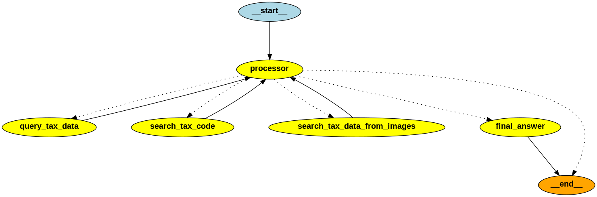

# Finance Chatbot Guide

**Table of Contents**

- [Finance Chatbot Guide](#finance-chatbot-guide)
  - [Overview and major functions](#overview-and-major-functions)
    - [Backend functions](#backend-functions)
      - [Adapative RAG solution graph](#adapative-rag-solution-graph)
    - [Frontend functions](#frontend-functions)
  - [Backend setup](#backend-setup)
  - [Frontend setup](#frontend-setup)
  - [Testing](#testing)

## Overview and major functions
The chatbot is powered by generative AI and RAG (Retrieved Augument Generation). 
- LLM I use OpenAI `GPT-4o-mini` which is high efficiency and fast multi-modal large language model, data embedding also use same. 
- Backend web framework I use `FastAPI` which is a very popular and high performance Python web framework built on AsyncIO and OpenAPI.
- Frontend I use React, which is also powerful frontend web framework.
- Generative AI framework I use Langchain, which is very popular and powerful framework which can efficiently develop generative AI features.
- RAG part we also use LangGragh which is very powerful tool to support complication agentic work flow and adaptive RAG.
- I also use Postgres as SQL DB and Chroma as vector data in app to save different kinds of data, I use docker build environment with these tools for app.
- App inlcudes simple user management and authentication,
- I have built a simple frontend UI to let user ingest all the raw data (indexing and put them in SQL DB or vector DB) and interact with chatbot

### Backend functions
Backend all APIs are built with Python and `FastAPI`, I also heavily use `Langchain` and `LangGraph` tools in chatbot related modules. I incudes docker-compose file to easily build and launch the backend locally with docker.

Following are major functions in backend:
- Simple auth based on OAuth2.0 and JWT
- Simple user management, including add, get users etc. Chat management do need user inforation, this is the reason I including user management.
- Differnt types of document ingestion, including
  - PDF file loader based on PyMuPdf, load PDF file, chunk, indexing and save into vector database (ChromaDB)
  - CSV file loader based on Pandas, load CSV file and import it into SQL database (Postgres)
  - PPT file loader based on Python-PPTX, load powerpoint file, extract all text and images, 
    - for text chunking based on slide, indexing and save into vector database (hromaDB), 
    - for images, we use multi-vector-retriever technology, for each image first get summary of image, and then indexing summary and save into vector database (Chroma, here use separate colllection), at same time encode image and save into object store and link with summary embedding. With this, later we can use summary match question to retrieve raw image, and feed them to LLM to get context, then we can search information from all images in PPT. 
- [Adapative RAG graph](#adapative-rag-solution-graph) with 4 agent / tool nodes, this is core part of this chatbot solution. It can dynamically route query to different agents to collect enough context from all data source (DB table, vector collections, images and LLM), and then get best answer with these context and LLM.
- For RAG retrieval, for input question I use query translation technique (get 3 relevant queries and retrieve top 5 of all similar contents) to improve answer accuracy
- Most service, especially database operation and web communicaiton part use full async way with better performance.
- Use file hash to record all ingested documents in DB, this can avoid duplicated work in file ingestion.
- Use docker to setup and management backend services, including API service, easy for testing and deployment.
- Auto populate new tables and create an admin user for testing.

#### Adapative RAG solution graph


### Frontend functions
Frontend is very simple, build based on React and Material UI. Just to let user ingest all the raw data (indexing and put them in SQL DB or vector DB) and interact with chatbot.

Following are major functions in Frontend:
- Auth support, all users need login to use app. Also button user can logout
- User can click `GENERATE KNOWLEDGE BASE` button to injest all the documents given in app requirements. Ingestion may take few minutes, once done will show alert
- UI for user to chat with chatbot, also show all chat history for same user

## Backend setup
As backend use docker to set up, need docker installed before running it. 

1. After you clone repository to local. Go to backend folder to set up .env file with contents in env.example file. You need openai api key for this app.

2. To start backend, just run following command in app root folder (/finace-chatbot):
```
npm run dev:backend
```
3. Then it will load all services in dockert and start backend api service. Once started, you use following url in browser to view all API
```
http://localhost:3100/docs
```

## Frontend setup
After you clone repository to local. 

1. Go to frontend folder to set up .env file with contents in env.example file. Just one line to set up backend api url config.

2. To start frontend, just run following command in app root folder (/finace-chatbot):
```
npm run dev:frontend
```

3. Once it is done, you can use following url in browser to view all API
```
http://localhost:4000
```
As we already auto create an admin user in backend for testing, so you can use following username and password to login
- username: admin
- password: 54321

4. You need first setup knowledge base to finish injestion of all data files. For this just click `GENERATE KNOWLEDGE BASE` button in top left corner. Normally it will take few minutes to finish everything, then you can chat with chatbot for any question.

## Testing
For PDF files contents, following is my testing questions:
1. What is definition of CRVM and CARVM?
   Answer I got: 
   CRVM stands for 'Credit Risk Valuation Model', used to assess the risk associated with credit exposure. CARVM stands for 'Capital Asset Risk Valuation Model', a framework for evaluating the risk of capital assets in investment portfolios.
2. How to calculate gift tax?
   Answer I got:
   To calculate gift tax, follow these steps: 1. Enter the amount from line 9. 2. Subtract line 11 from line 10. 3. Enter specific amounts based on your filing status: - $492,300 if single, - $276,900 if married filing separately, - $553,850 if married filing jointly or qualifying surviving spouse, - $523,050 if head of household. 4. Enter the smaller of line 1 or line 13. 5. Add lines 5 and 9. 6. Subtract line 15 from line 14; if zero or less, enter -0-. 7. Enter the smaller of line 12 or line 16. 8. Multiply line 17 by 15% (0.15). 9. Figure the tax on the amount using the appropriate tax table or worksheet.
3. How to handle tax for expensing of environmental remediation costs?
   Answer I got:
   To handle tax for expensing environmental remediation costs, consider the following: 1. **Form 6251**: Complete this form if you have claimed certain items like accelerated depreciation or tax-exempt interest. 2. **Deductions**: Environmental remediation costs may be deductible as business expenses, but specific rules apply. Consult IRS guidelines or a tax professional for details. 3. **Health Savings Account (HSA) Deduction**: Contributions to an HSA may impact your tax situation. 4. **Moving Expenses**: Members of the Armed Forces may have specific deductions related to moving expenses. For precise guidance, consult a tax professional or refer to IRS publications.
4. What is income range for married couples for 25% marginal tax rate?
   Answer I got:
   The income range for married couples for the 25% marginal tax rate is over $190,750 but not over $364,200.

For CSV table contents, following is my testing questions:
1. What is total taxable income of state TX in 2019 for corporation taxpayer type?
   Answer I got:
   The total taxable income for corporation taxpayer type in Texas for 2019 is 3,200,000.00.
2. What is total tax owed for 2019 non-profit taxpayer type?
   Answer I got:
   The total tax owed for the 2019 non-profit taxpayer type is $22,146,449.79.
3. What is total taxable income of state TX in 2024 for corporation taxpayer type?
   Answer I got: (Should be 'I don't know' as for sure there is no data in CSV table or LLM for that year)
   I don't know.

For PPT file contents, following is my testing questions:
1. What is impact of a tax on coffee supply?
   Answer I got:
   The impact of a tax on coffee supply typically leads to a decrease in supply, resulting in higher prices for consumers and a reduction in the quantity of coffee sold in the market.
2. What is top marginal federal income tax rate in year 1980?
   Answer I got:
   The top marginal federal income tax rate in 1980 was 70%.
3. Whta is trend of total taxes in united states from year 1950 to 2010?
   Answer I got:
   The trend of total taxes in the United States from 1950 to 2010 shows a general increase in tax receipts as a percent of GDP, with significant rises during periods of economic growth and increased government expenditure.


